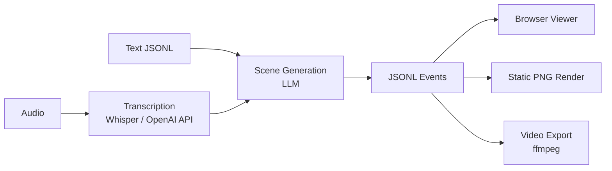
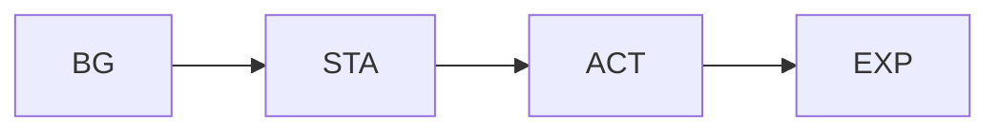

<p align="center">
  <h1 align="center">🎙️ Talk2Scene</h1>
  <p align="center">
    <em>Audio-driven intelligent animation generation — from dialogue to visual storytelling.</em>
  </p>
  <p align="center">
    
    
    
    
    
  </p>
</p>

---

Talk2Scene is an **audio-driven intelligent animation tool** that automatically parses voice dialogue files, recognizes text content and timestamps, and uses AI to recommend matching **character stances (STA)**, **expressions (EXP)**, **actions (ACT)**, **backgrounds (BG)**, and **CG illustrations** inserted at the right moments. It produces structured scene event data and composes preview videos showing AI characters performing dynamically across scenes.

Designed for **content creators**, **educators**, **virtual streamers**, and **AI enthusiasts** — Talk2Scene turns audio into engaging visual narratives for interview videos, AI interactive demos, educational presentations, and more.

## 💡 Why Talk2Scene

Manually composing visual scenes for dialogue-driven content is tedious and error-prone. Talk2Scene automates the entire workflow: feed in audio or a transcript, and the pipeline produces **time-synced scene events** — ready for browser playback or video export — without touching a single frame by hand.

## 🏗️ Architecture



Scenes are composed from **five layer types** stacked bottom-up:



> A **CG** illustration, when active, replaces the entire layered scene.

## 📦 Install

> [!IMPORTANT]
> Requires **Python 3.11+**, [uv](https://docs.astral.sh/uv/), and **FFmpeg**.

```bash
uv sync
```

Set your OpenAI API key:

```bash
export OPENAI_API_KEY="your-key"
```

## 🚀 Usage

```bash
uv run talk2scene --help
```

### 📝 Text Mode

Generate scenes from a pre-transcribed JSONL file:

```bash
uv run talk2scene mode=text io.input.text_file=path/to/transcript.jsonl
```

### 🎧 Batch Mode

Process an audio file end-to-end (place audio in `input/`):

```bash
uv run talk2scene mode=batch
```

### 🎬 Video Mode

Render a completed session into video:

```bash
uv run talk2scene mode=video session_id=SESSION_ID
```

### 📡 Stream Mode

Consume audio or pre-transcribed text from Redis in real time:

```bash
uv run talk2scene mode=stream
```

## 📚 Documentation

Full documentation (English & 中文) is available at **[discover304.top/talk2scene](https://discover304.top/talk2scene)**.

## 📬 Contact

- ✉️ Email: **hobart.yang@qq.com**
- 🐛 Issues: [Open an issue](../../issues) on GitHub

## 📄 License

Licensed under the [Apache License 2.0](LICENSE).
