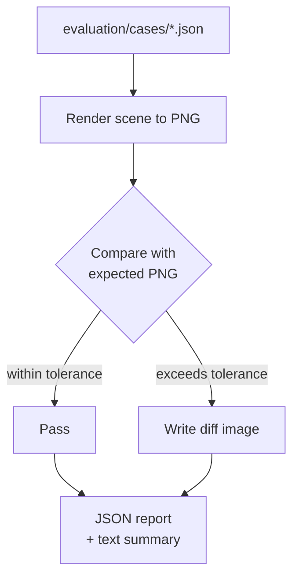

# :test_tube: Evaluation Framework

The evaluation framework is **separate from unit tests**. It performs visual regression testing by rendering scenes and comparing with golden PNGs.

## :file_folder: Structure

```
evaluation/
├── cases/      # Scene input JSON files
├── expected/   # Golden PNG images
├── output/     # Rendered PNGs (generated)
└── diffs/      # Diff images on failure
```

## :rocket: Running Evaluation

```bash
uv run talk2scene eval.run=true
```

## :mag: How It Works



## :straight_ruler: Comparison Methods

- :eye: **Pixel diff**: Percentage of differing pixels (configurable tolerance)
- :hash: **Perceptual hash**: Hamming distance between image hashes

## :vs: Tests vs Evaluation

| | tests/ | evaluation/ |
|---|--------|-------------|
| :label: Type | Unit tests | Visual regression |
| :hammer_and_wrench: Tool | pytest | Built-in runner |
| :white_check_mark: Checks | Logic correctness | Render correctness |
| :package: Artifacts | - | PNG renders + diffs |
