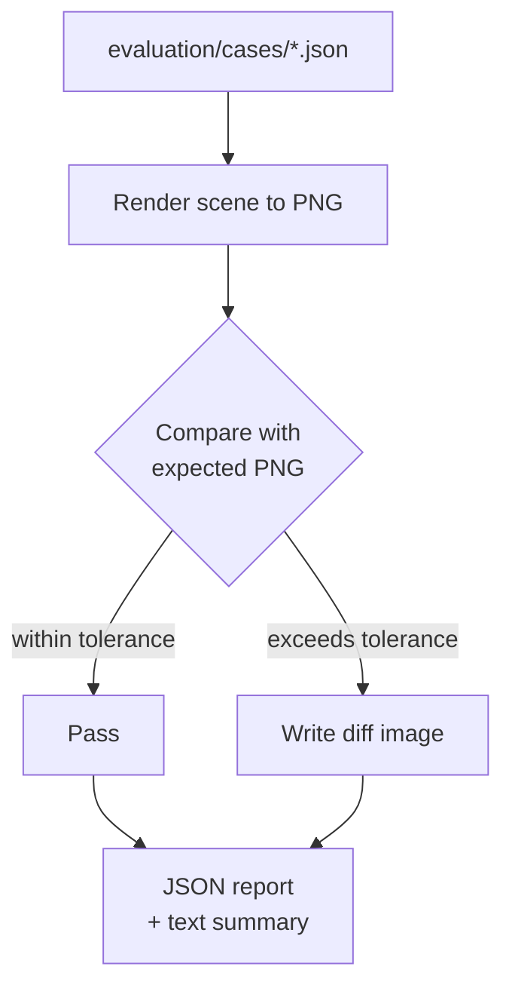

# 🧪 Evaluation Framework

The evaluation framework is **separate from unit tests**. It performs visual regression testing by rendering scenes and comparing with golden PNGs.

## 📁 Structure

```
evaluation/
├── cases/      # Scene input JSON files
├── expected/   # Golden PNG images
├── output/     # Rendered PNGs (generated)
└── diffs/      # Diff images on failure
```

## 🚀 Running Evaluation

```bash
uv run talk2scene eval.run=true
```

## 🔍 How It Works



## 📏 Comparison Methods

- 👁️ **Pixel diff**: Percentage of differing pixels (configurable tolerance)
- #️⃣ **Perceptual hash**: Hamming distance between image hashes

## 🆚 Tests vs Evaluation

| | tests/ | evaluation/ |
|---|--------|-------------|
| 🏷️ Type | Unit tests | Visual regression |
| 🛠️ Tool | pytest | Built-in runner |
| ✅ Checks | Logic correctness | Render correctness |
| 📦 Artifacts | - | PNG renders + diffs |
