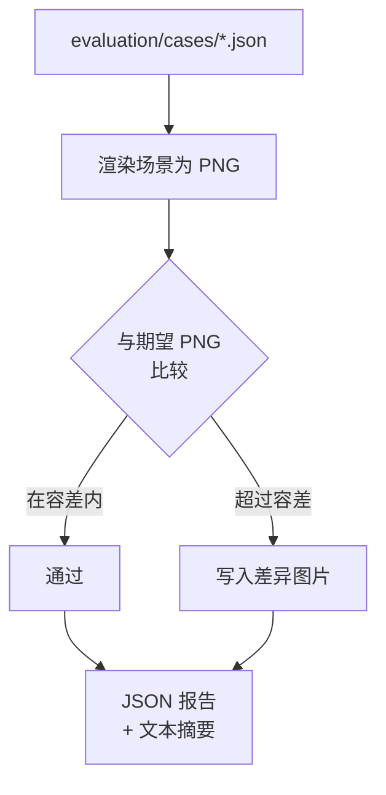

# :test_tube: 评估框架

评估框架**独立于单元测试**。它通过渲染场景并与标准 PNG 比较来进行视觉回归测试。

## :file_folder: 结构

```
evaluation/
├── cases/      # 场景输入 JSON 文件
├── expected/   # 标准 PNG 图片
├── output/     # 渲染的 PNG（生成的）
└── diffs/      # 失败时的差异图片
```

## :rocket: 运行评估

```bash
uv run talk2scene eval.run=true
```

## :mag: 工作原理



## :vs: 测试 vs 评估

| | tests/ | evaluation/ |
|---|--------|-------------|
| :label: 类型 | 单元测试 | 视觉回归 |
| :hammer_and_wrench: 工具 | pytest | 内置运行器 |
| :white_check_mark: 检查 | 逻辑正确性 | 渲染正确性 |
| :package: 产物 | - | PNG 渲染 + 差异图 |
