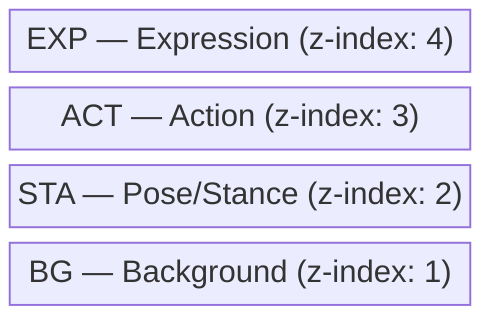
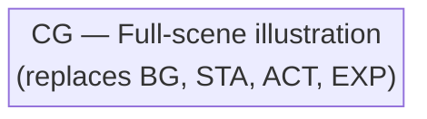

# :desktop_computer: Browser Frontend

The frontend loads JSONL events and animates scene layers in the browser.

## :play_or_pause_button: Modes

### :rewind: Replay Mode
Plays events from the beginning with timing based on timestamps.

### :satellite: Realtime Mode
Shows the latest event, polling for new events.

## :layer_cake: Layering Order

### Normal mode (`CG_None`)

### CG mode (any CG other than `CG_None`)

## :arrow_forward: Usage

1. :globe_with_meridians: Open `web/index.html` in a browser
2. :open_file_folder: Load a `.jsonl` file
3. :file_folder: Set the asset base path
4. :play_or_pause_button: Click **Replay** or **Realtime**
5. :headphones: Optionally load a WAV file for audio sync

## :sparkles: Features

- :fast_forward: Speed control (0.25x - 4x)
- :control_knobs: Timeline scrubbing
- :scroll: Event log
- :headphones: Audio sync support
