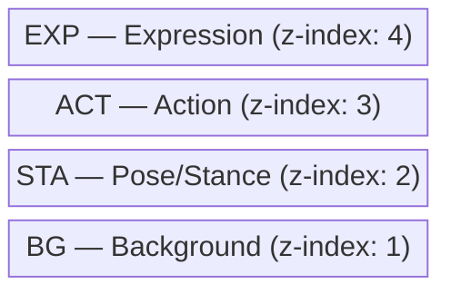
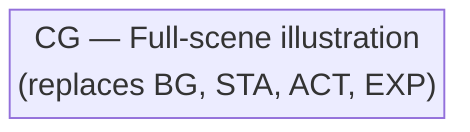

# 🖥️ Browser Frontend

The frontend loads JSONL events and animates scene layers in the browser.

## ⏯️ Modes

### ⏪ Replay Mode
Plays events from the beginning with timing based on timestamps.

### 📡 Realtime Mode
Shows the latest event, polling for new events.

## 🍰 Layering Order

### Normal mode (`CG_None`)

### CG mode (any CG other than `CG_None`)

## ▶️ Usage

1. 🌐 Open `web/index.html` in a browser
2. 📂 Load a `.jsonl` file
3. 📁 Set the asset base path
4. ⏯️ Click **Replay** or **Realtime**
5. 🎧 Optionally load a WAV file for audio sync

## ✨ Features

- ⏩ Speed control (0.25x - 4x)
- 🎛️ Timeline scrubbing
- 📜 Event log
- 🎧 Audio sync support
