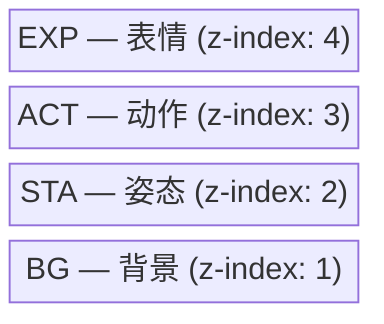
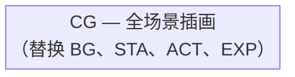

# :desktop_computer: 浏览器前端

前端加载 JSONL 事件并在浏览器中进行场景图层动画。

## :play_or_pause_button: 模式

### :rewind: 回放模式
从头开始播放事件，基于时间戳控制时序。

### :satellite: 实时模式
显示最新事件，轮询新事件。

## :layer_cake: 图层顺序

### 普通模式（`CG_None`）

### CG模式（CG不为 `CG_None`）

## :arrow_forward: 使用方法

1. :globe_with_meridians: 在浏览器中打开 `web/index.html`
2. :open_file_folder: 加载 `.jsonl` 文件
3. :file_folder: 设置素材基础路径
4. :play_or_pause_button: 点击 **Replay** 或 **Realtime**
