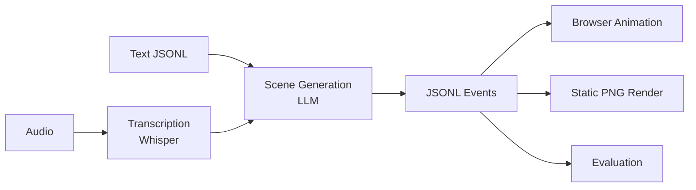

# 🎤 Talk2Scene

Talk2Scene converts audio dialogue into a stream of scene events (JSONL) that can be animated in a browser in realtime or replay mode.

## ⭐ Key Features

- 🧩 **Scene-first architecture**: Scenes are composable, testable, and renderable as static PNGs or animated in the frontend
- 📄 **JSONL streaming**: Primary output format with derived JSON and CSV exports
- ✅ **Strict whitelist**: STA/EXP/ACT/BG/CG codes validated against whitelist
- 🔒 **Deterministic rendering**: Scene composition is deterministic for evaluation
- 🌐 **Bilingual docs**: English and Chinese documentation

## ⚙️ Pipeline



## 🚀 Quick Start

```bash
# Install
uv sync

# Generate placeholder assets
uv run talk2scene mode=generate-assets

# Process transcript text directly (no audio needed)
uv run talk2scene mode=text io.input.text_file=input/sample_transcript.jsonl

# Run batch mode (audio → transcription → scenes)
uv run talk2scene mode=batch

# Run evaluation
uv run talk2scene eval.run=true

# Start streaming mode
uv run talk2scene mode=stream
```
