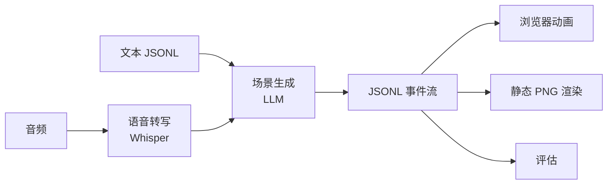

# 🎤 Talk2Scene

Talk2Scene 将音频对话转换为场景事件流 (JSONL)，可在浏览器中实时或回放模式下进行动画展示。

## ⭐ 主要特点

- 🧩 **场景优先架构**：场景可组合、可测试，可渲染为静态 PNG 或在前端动画展示
- 📄 **JSONL 流式输出**：主要输出格式，支持派生 JSON 和 CSV 导出
- ✅ **严格白名单**：STA/EXP/ACT/BG/CG 代码通过白名单验证
- 🔒 **确定性渲染**：场景合成是确定性的，用于评估
- 🌐 **双语文档**：英文和中文文档

## ⚙️ 处理流程



## 🚀 快速开始

```bash
# 安装
uv sync

# 生成占位素材
uv run talk2scene mode=generate-assets

# 文本模式（直接处理转写文本，无需音频）
uv run talk2scene mode=text io.input.text_file=input/sample_transcript.jsonl

# 批处理模式（音频 → 转写 → 场景）
uv run talk2scene mode=batch

# 运行评估
uv run talk2scene eval.run=true

# 流式模式
uv run talk2scene mode=stream
```
