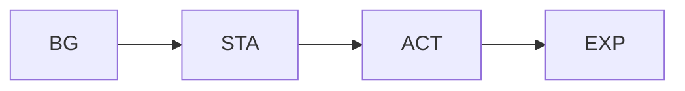

# 🎙️ Talk2Scene

*音频驱动的智能动画生成 — 从对话到视觉叙事。*


---

Talk2Scene 是一个**音频驱动的智能动画生成工具**，能够自动解析语音杂谈文件，识别文本内容与时间节点，并基于 AI 推荐适合的**角色姿态（STA）**、**表情（EXP）**、**动作（ACT）**、**背景（BG）**，在适当位置插入 **CG 插画**。最终生成结构化的场景事件数据，并自动合成预览视频，展现 AI 角色在不同场景中的动态表现。

该工具专为**内容创作者**、**教育工作者**、**虚拟主播**和 **AI 爱好者**设计，可广泛用于访谈视频、AI 互动演示、教育讲解等场景，帮助创作者轻松实现从音频到可视化动画的智能转换。

## 💡 为什么做 Talk2Scene

为对话内容手动编排视觉场景既繁琐又容易出错。Talk2Scene 将整个工作流自动化：输入音频或文本，管线即可生成**带时间同步的场景事件**——可直接在浏览器中播放或导出为视频——无需手动处理任何一帧画面。

## 🏗️ 架构

```mermaid
flowchart LR
    A[音频] --> B[语音转录\nWhisper / OpenAI API]
    T[文本 JSONL] --> C
    B --> C[场景生成\nLLM]
    C --> D[JSONL 事件]
    D --> E[浏览器查看器]
    D --> F[静态 PNG 渲染]
    D --> G[视频导出\nffmpeg]
```



场景由**五种图层类型**自底向上堆叠：



> **CG** 插画激活时会替换整个分层场景。

## 🖼️ 示例输出

### 示例视频

<p align="center">
  
</p>

### 渲染场景

<p align="center">
  
  
  
</p>

<p align="center">
  <em>左：基础场景（实验室 + 正面站立 + 中性表情） · 中：咖啡厅场景（咖啡厅 + 正面站立 + 思考） · 右：CG 模式（潘多拉科技）</em>
</p>

### 素材图层

每个场景由透明素材图层叠加在背景上合成。以下是每个类别的一个示例：

| 图层 | 示例 | 编码 | 说明 |
|:----:|:----:|------|------|
| 🌅 **BG** |  | `BG_Lab_Modern` | 背景（不透明） |
| 🧠**STA** |  | `STA_Stand_Front` | 姿æ€ï¼ˆé€æ˜ï¼‰ |
| 🭠**EXP** |  | `EXP_Smile_EyesClosed` | 表情å åŠ ï¼ˆé€æ˜ï¼‰ |
| 🤚 **ACT** |  | `ACT_WaveGreeting` | 动作叠加（透明） |
| ✨ **CG** |  | `CG_PandorasTech` | 全场景插画（替换所有图层） |

## 📦 安装

!!! important
    需要 **Python 3.11+**、[uv](https://docs.astral.sh/uv/) 和 **FFmpeg**。

```bash
uv sync
```

设置 OpenAI API 密钥：

```bash
export OPENAI_API_KEY="your-key"
```

## 🚀 使用

```bash
uv run talk2scene --help
```

### 📝 文本模式

从预转录的 JSONL 文件生成场景：

```bash
uv run talk2scene mode=text io.input.text_file=path/to/transcript.jsonl
```

### 🎧 批处理模式

端到端处理音频文件（将音频放入 `input/`）：

```bash
uv run talk2scene mode=batch
```

### 🎬 视频模式

将已完成的会话渲染为视频：

```bash
uv run talk2scene mode=video session_id=SESSION_ID
```

### 📡 流式模式

通过 Redis 实时消费音频或预转录文本：

```bash
uv run talk2scene mode=stream
```

## 📬 联系

- ✉️ 邮箱：**hobart.yang@qq.com**
- 🐛 问题反馈：在 GitHub [提交 issue](https://github.com/yhbcode000/talk2scene/issues)

## 📄 许可证

基于 [Apache License 2.0](https://github.com/yhbcode000/talk2scene/blob/main/LICENSE) 开源。
