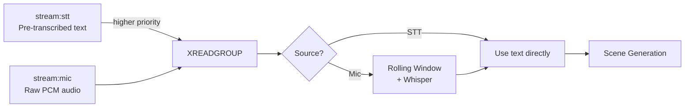

# 📡 Redis Audio Streaming

Talk2Scene consumes from two Redis Streams for realtime processing: a pre-transcribed **STT stream** and a raw **mic stream**. When both are available, STT messages take priority (Whisper is skipped).

## 🔄 Dual-Stream Architecture



| Stream | Key | Content | Processing |
|--------|-----|---------|------------|
| 💬 STT | `stream:stt` | Pre-transcribed text from an external STT service | Bypass Whisper, use text directly |
| 🎙️ Mic | `stream:mic` | Raw PCM audio bytes | Rolling window + Whisper transcription |

Both streams are read in a single `XREADGROUP` call. STT stream is listed first so its messages are yielded before mic messages within the same batch.

## 📄 Stream Formats

### stream:stt

Published by an upstream orchestrator (e.g. `orchestrator/nodes/standard_stt.py`):

| Field | Type | Description |
|-------|------|-------------|
| `type` | string | `"final"` or `"segment"` (only `final` is processed) |
| `text` | string | Transcribed text |
| `audio_type` | string | `"speech"`, `"piano"`, `"humming"`, `"music"` |
| `segments` | string | JSON array of `[{type, text, start, end}, ...]` |
| `timestamp` | float | Unix timestamp |
| `start_time` | float | Segment start time (optional) |
| `end_time` | float | Segment end time (optional) |

### stream:mic

Published by an audio I/O node (e.g. `orchestrator/nodes/standard_audio_io.py`):

| Field | Type | Description |
|-------|------|-------------|
| `audio` | bytes | Raw 16-bit PCM audio |
| `sample_rate` | string | `"16000"` |
| `channels` | string | `"1"` |
| `format` | string | `"int16"` |
| `timestamp` | float | Unix timestamp |

## 📤 Publishing Examples

```python
import redis, time, json
r = redis.Redis()

# Publish pre-transcribed text (STT path)
r.xadd("stream:stt", {
    "type": "final",
    "text": "Hello everyone, welcome to the lab.",
    "audio_type": "speech",
    "timestamp": str(time.time()),
    "start_time": "0.0",
    "end_time": "3.5",
})

# Publish raw audio (mic path)
r.xadd("stream:mic", {"audio": audio_bytes})
```

## 👥 Consumer Groups

Talk2Scene creates a consumer group on **both** streams:

- Consumer group: `talk2scene` (configurable)
- Messages are acknowledged after processing
- Backpressure control via `backpressure_max` (checked on both streams using `XPENDING`)

## ⏲️ Rolling Window

When processing mic audio, transcription uses a rolling window (default 30s) to maintain context across chunks. STT messages bypass this entirely since the text is already transcribed.

## 🔧 Configuration

```yaml
# conf/stream/default.yaml
redis:
  stream_key: "stream:mic"
  stt_stream_key: "stream:stt"
  consumer_group: "talk2scene"
  consumer_name: "worker-1"
  block_ms: 1000
  batch_size: 10
  backpressure_max: 100
```
