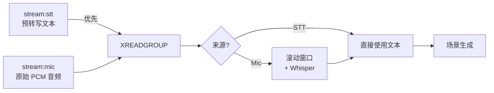

# 📡 Redis 音频流

Talk2Scene 从两个 Redis Stream 进行实时消费：预转写的 **STT 流** 和原始 **麦克风流**。两者同时可用时，STT 消息优先处理（跳过 Whisper）。

## 🔄 双流架构



| 流 | Key | 内容 | 处理方式 |
|----|-----|------|----------|
| 💬 STT | `stream:stt` | 外部 STT 服务预转写的文本 | 跳过 Whisper，直接使用文本 |
| 🎙️ Mic | `stream:mic` | 原始 PCM 音频字节 | 滚动窗口 + Whisper 转写 |

两个流在单次 `XREADGROUP` 调用中读取。STT 流排在前面，因此同一批次中 STT 消息先于麦克风消息被处理。

## 📄 流格式

### stream:stt

由上游编排器发布（如 `orchestrator/nodes/standard_stt.py`）：

| 字段 | 类型 | 说明 |
|------|------|------|
| `type` | string | `"final"` 或 `"segment"`（仅处理 `final`） |
| `text` | string | 转写文本 |
| `audio_type` | string | `"speech"`、`"piano"`、`"humming"`、`"music"` |
| `segments` | string | JSON 数组 `[{type, text, start, end}, ...]` |
| `timestamp` | float | Unix 时间戳 |
| `start_time` | float | 段落起始时间（可选） |
| `end_time` | float | 段落结束时间（可选） |

### stream:mic

由音频 I/O 节点发布（如 `orchestrator/nodes/standard_audio_io.py`）：

| 字段 | 类型 | 说明 |
|------|------|------|
| `audio` | bytes | 原始 16 位 PCM 音频 |
| `sample_rate` | string | `"16000"` |
| `channels` | string | `"1"` |
| `format` | string | `"int16"` |
| `timestamp` | float | Unix 时间戳 |

## 📤 发布示例

```python
import redis, time, json
r = redis.Redis()

# 发布预转写文本（STT 路径）
r.xadd("stream:stt", {
    "type": "final",
    "text": "大家好，欢迎来到实验室。",
    "audio_type": "speech",
    "timestamp": str(time.time()),
    "start_time": "0.0",
    "end_time": "3.5",
})

# 发布原始音频（麦克风路径）
r.xadd("stream:mic", {"audio": audio_bytes})
```

## 👥 消费者组

Talk2Scene 在 **两个** 流上创建消费者组：

- 消费者组：`talk2scene`（可配置）
- 处理完成后确认消息
- 通过 `backpressure_max` 进行背压控制（使用 `XPENDING` 检查两个流）

## ⏲️ 滚动窗口

处理麦克风音频时，转写使用滚动窗口（默认 30 秒）在块之间保持上下文。STT 消息完全跳过此步骤，因为文本已经过转写。

## 🔧 配置

```yaml
# conf/stream/default.yaml — https://github.com/yhbcode000/talk2scene/blob/main/conf/stream/default.yaml
redis:
  stream_key: "stream:mic"
  stt_stream_key: "stream:stt"
  consumer_group: "talk2scene"
  consumer_name: "worker-1"
  block_ms: 1000
  batch_size: 10
  backpressure_max: 100
```
