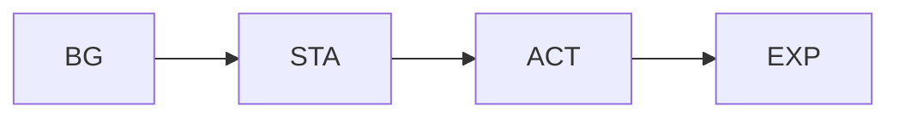
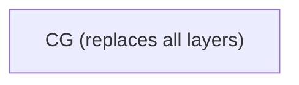

# 🖼️ Scene Renderer

The scene renderer composes asset layers into a single PNG deterministically.

## 🍰 Layering

Normal mode (`CG_None`): layers are composited bottom-to-top:



CG mode (any CG other than `CG_None`): the CG illustration replaces the entire scene — BG, STA, ACT, and EXP are all hidden.



## 🔌 API

```python
from talk2scene.renderer import render_scene

scene_state = {
    "bg": "BG_Lab_Modern",
    "sta": "STA_Stand_Front",
    "exp": "EXP_Smile_EyesClosed",
    "act": "ACT_None",
    "cg": "CG_None",
}

image = render_scene(scene_state, asset_dirs, canvas_size=(1024, 1024))
image.save("output.png")
```

## ⌨️ CLI

```bash
uv run talk2scene render.scene=true render.scene_file=scene.json
```

## 🎬 Video Rendering

Video mode renders scene events into a video file with optional burned-in subtitles.

### ⚡ Parallel Rendering

Instead of rendering every frame sequentially (e.g. 750 frames for a 25s video at 30fps), the video pipeline renders only one image per scene in parallel using `multiprocessing.Pool`, then uses ffmpeg's **concat demuxer** with per-scene durations to produce the final video. This is significantly faster since the number of unique scene images is typically much smaller than the total frame count.

```bash
# Render video (webm by default)
uv run talk2scene mode=video session_id=my_session

# Different format
uv run talk2scene mode=video session_id=my_session render.video.format=mp4

# Disable subtitle burn-in
uv run talk2scene mode=video session_id=my_session render.video.subtitle=false

# Disable auto-preview
uv run talk2scene mode=video session_id=my_session render.video.preview=false
```

### ⚙️ Video Configuration

| Setting | Default | Description |
|---------|---------|-------------|
| `render.video.fps` | `30` | Output frame rate |
| `render.video.crf` | `18` | Constant rate factor (quality) |
| `render.video.format` | `webm` | Output format: `webm`, `mp4`, or `avi` |
| `render.video.subtitle` | `true` | Burn subtitles into video |
| `render.video.subtitle_font_size` | `32` | Subtitle font size in pixels |
| `render.video.preview` | `true` | Open video after rendering (`xdg-open`) |

## 📺 Live Front-Page Rendering

In streaming mode, Talk2Scene can render the current scene to `front_page.png` after each batch of scene events. Enable with:

```yaml
render:
  scene_on_event: true
```

This is useful for displaying a live preview in a web frontend or dashboard.

## 🔒 Determinism

Rendering is deterministic: the same inputs always produce the same output PNG. This is critical for the evaluation framework.
