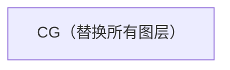

# 🖼️ 场景渲染器

场景渲染器将素材图层确定性地合成为单个 PNG。

## 🍰 图层顺序

普通模式（`CG_None`）：图层自底向上合成：


CG模式（CG不为 `CG_None`）：CG插画替换整个场景——BG、STA、ACT、EXP 全部隐藏。



## 🔌 API

```python
from talk2scene.renderer import render_scene

scene_state = {
    "bg": "BG_Lab_Modern",
    "sta": "STA_Stand_Front",
    "exp": "EXP_Smile_EyesClosed",
    "act": "ACT_None",
    "cg": "CG_None",
}

image = render_scene(scene_state, asset_dirs, canvas_size=(1024, 1024))
image.save("output.png")
```

## ⌨️ 命令行

```bash
uv run talk2scene render.scene=true render.scene_file=scene.json
```

## 🎬 视频渲染

视频模式将场景事件渲染为视频文件，支持可选的字幕烧录。

### ⚡ 并行渲染

视频管线不再逐帧渲染（例如 25 秒视频在 30fps 下需要渲染 750 帧），而是使用 `multiprocessing.Pool` 并行渲染每个场景仅一张图片，再通过 ffmpeg 的 **concat 分离器** 按场景时长拼接最终视频。由于独立场景图片数量通常远少于总帧数，速度显著提升。

```bash
# 渲染视频（默认 webm）
uv run talk2scene mode=video session_id=my_session

# 指定格式
uv run talk2scene mode=video session_id=my_session render.video.format=mp4

# 关闭字幕烧录
uv run talk2scene mode=video session_id=my_session render.video.subtitle=false

# 关闭自动预览
uv run talk2scene mode=video session_id=my_session render.video.preview=false
```

### ⚙️ 视频配置

| 设置 | 默认值 | 说明 |
|------|--------|------|
| `render.video.fps` | `30` | 输出帧率 |
| `render.video.crf` | `18` | 恒定质量因子 |
| `render.video.format` | `webm` | 输出格式：`webm`、`mp4` 或 `avi` |
| `render.video.subtitle` | `true` | 在视频中烧录字幕 |
| `render.video.subtitle_font_size` | `32` | 字幕字号（像素） |
| `render.video.preview` | `true` | 渲染后打开视频（`xdg-open`） |

## 📺 实时封面渲染

在流式模式下，Talk2Scene 可在每批场景事件后将当前场景渲染为 `front_page.png`。启用方式：

```yaml
render:
  scene_on_event: true
```

适用于在 Web 前端或仪表盘中显示实时预览。

## 🔒 确定性

渲染是确定性的：相同输入始终产生相同的 PNG 输出。这对评估框架至关重要。
