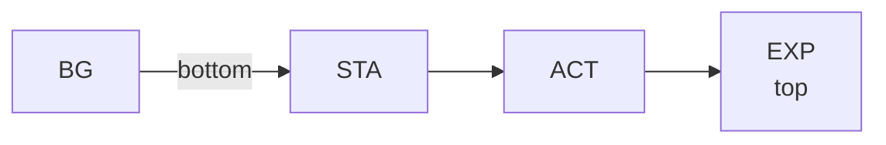
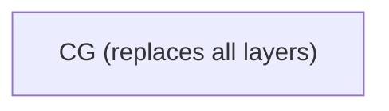

# :clipboard: Whitelist & Layering Rules

## :shield: Whitelist

`conf/whitelist.yaml` is the single source of truth for valid component codes.

### :bookmark_tabs: Categories

- :standing_person: **STA** (Stance/Pose): Character body pose
- :performing_arts: **EXP** (Expression): Facial expression overlay
- :raised_hand: **ACT** (Action): Character action animation
- :sunrise_over_mountains: **BG** (Background): Scene background
- :sparkles: **CG** (CG illustration): Full-scene illustration that replaces the entire layered composition (like a CG scene in visual novels/games). When CG is not `CG_None`, BG/STA/ACT/EXP are all hidden.

### :white_check_mark: Valid Codes

| Category | Codes |
|----------|-------|
| :standing_person: STA | `STA_Stand_Front`, `STA_Stand_Side`, `STA_Stand_Lean` |
| :performing_arts: EXP | `EXP_Neutral`, `EXP_Thinking`, `EXP_Astonished`, `EXP_Concerned`, `EXP_Laugh`, `EXP_Smile_EyesClosed`, `EXP_PretendClueless` |
| :raised_hand: ACT | `ACT_None`, `ACT_ArmsCrossed`, `ACT_PalmOpen`, `ACT_GlassesPush`, `ACT_HandOnHip`, `ACT_HeadTilt`, `ACT_MouthCover`, `ACT_ObjectPresent`, `ACT_WaveGreeting`, `ACT_WaveFarewell` |
| :sunrise_over_mountains: BG | `BG_Lab_Modern`, `BG_Garden_Rooftop`, `BG_Cafe_Starbucks` |
| :sparkles: CG | `CG_None`, `CG_PandorasTech` |

### :hammer_and_wrench: Validation

All scene events are validated against the whitelist. Invalid codes are auto-repaired to the default (first) code in each category.

## :layer_cake: Layering Order

### Normal mode (`CG_None`)

### CG mode (any CG other than `CG_None`)

This order is enforced in both the renderer and the frontend.
