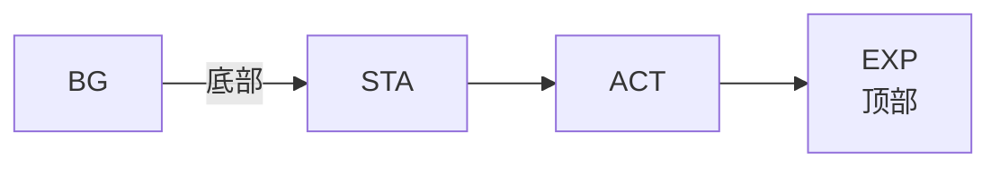
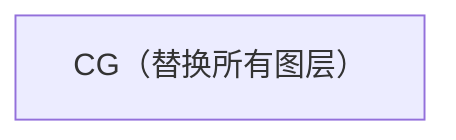

# :clipboard: 白名单与图层规则

## :shield: 白名单

`conf/whitelist.yaml` 是有效组件代码的唯一数据源。

### :bookmark_tabs: 类别

- :standing_person: **STA**（姿态）：角色身体姿势
- :performing_arts: **EXP**（表情）：面部表情叠加
- :raised_hand: **ACT**（动作）：角色动作动画
- :sunrise_over_mountains: **BG**（背景）：场景背景
- :sparkles: **CG**（CG插画）：替换整个图层合成的全场景插画（类似视觉小说/游戏中的CG场景）。当CG不为 `CG_None` 时，BG/STA/ACT/EXP 全部隐藏。

### :white_check_mark: 有效代码

| 类别 | 代码 |
|------|------|
| :standing_person: STA | `STA_Stand_Front`, `STA_Stand_Side`, `STA_Stand_Lean` |
| :performing_arts: EXP | `EXP_Neutral`, `EXP_Thinking`, `EXP_Astonished`, `EXP_Concerned`, `EXP_Laugh`, `EXP_Smile_EyesClosed`, `EXP_PretendClueless` |
| :raised_hand: ACT | `ACT_None`, `ACT_ArmsCrossed`, `ACT_PalmOpen`, `ACT_GlassesPush`, `ACT_HandOnHip`, `ACT_HeadTilt`, `ACT_MouthCover`, `ACT_ObjectPresent`, `ACT_WaveGreeting`, `ACT_WaveFarewell` |
| :sunrise_over_mountains: BG | `BG_Lab_Modern`, `BG_Garden_Rooftop`, `BG_Cafe_Starbucks` |
| :sparkles: CG | `CG_None`, `CG_PandorasTech` |

### :hammer_and_wrench: 验证

所有场景事件都通过白名单验证。无效代码会自动修复为每个类别的默认（第一个）代码。

## :layer_cake: 图层顺序

### 普通模式（`CG_None`）

### CG模式（CG不为 `CG_None`）

此顺序在渲染器和前端中都强制执行。
